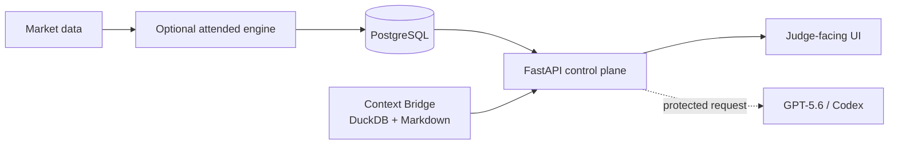

# AngeL · NerTzhuLz

  <strong>Real-time systems · Automation · DevOps · Protected AI tooling</strong> 
  Building software that makes state, evidence and operational boundaries visible.

  
  
  

## At a glance

| Area | What I build |
| --- | --- |
| Real-time engineering | Market data, event pipelines, reconciliation and stateful services |
| Backend & DevOps | Python, FastAPI, PostgreSQL, Docker, runbooks and health checks |
| AI-assisted development | Explicit GPT-5.6/Codex boundaries, local context and reproducible evidence |
| Automation | Discord/community tooling, APIs and operational workflows |
| Quality | Small measurable fixes, tests, audit trails and safe demo environments |

## Flagship: NerTzh Metrics Control Plane

An evidence-first local control plane for Bybit spot metrics, Context Bridge
state and optional protected GPT-5.6/Codex-assisted analysis.

- FastAPI judge surface on `:8081` with a responsive monitoring UI.
- Optional attended Bybit demo engine isolated on `:8082`.
- PostgreSQL for engine state; DuckDB + Markdown for local context.
- Read-only by default; no automatic model calls or live execution.
- Reconciliation across market, database and exchange state.

**[Open the repository →](https://github.com/NerTzhuLz/NerTzh)** ·
**[Watch the Build Week release →](https://github.com/NerTzhuLz/NerTzh/releases/tag/v0.1.0-build-week)** ·
**[Read the Devpost entry →](https://devpost.com/software/nertzh)**

## System design

## Selected work

- **Trading infrastructure:** NerTzh, Adjudicator/Bybit research, TSM exchange
  formulas and state-reconciliation experiments.
- **Developer platforms:** FastAPI services, Python automation and local agent
  tooling.
- **Community automation:** Discord bots and operational tools dating back to
  2020.
- **Organization:** [NerThzBottZq](https://github.com/NerThzBottZq) for shared
  experiments and developer tooling.

Private or historical projects remain private until their dependencies,
licenses, credentials and reproducibility are reviewed.

## Engineering principles

1. Reconcile market, database and exchange state before acting.
2. Prefer a small, measurable correction over a large rewrite.
3. Keep credentials and private community data out of public repositories.
4. Make automation observable, attended and reversible.
5. Document the boundary between evidence, inference and execution.

## Contact and links

- [GitHub organization](https://github.com/NerThzBottZq)
- [NerTzh documentation](https://github.com/NerTzhuLz/NerTzh/tree/main/docs)
- [Build Week project](https://devpost.com/software/nertzh)
